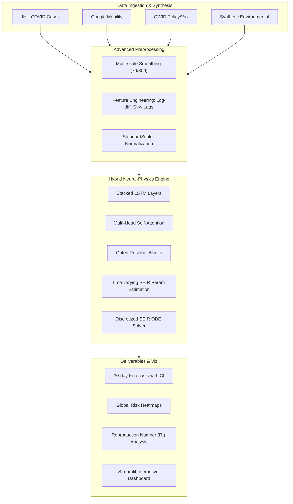

# 🌍 Epidemic Spread Prediction
### *Advanced Epidemic Forecasting with Hybrid Attention-SEIR-LSTM Physics-Informed Models*

[](https://www.python.org/)
[](https://pytorch.org/)
[](https://streamlit.io/)
[](LICENSE)

---

## 📖 Project Overview
This project presents an end-to-end pipeline for **global epidemic forecasting and risk assessment**. By integrating epidemiological data from **Johns Hopkins**, mobility metrics from **Google**, and policy/vaccination indicators from **Our World in Data (OWID)**, the system achieves state-of-the-art predictive performance while maintaining biological consistency through a **Physics-Informed Neural Network (PINN)** approach.

The core engine is a **Hybrid Attention-SEIR-LSTM** model that captures complex temporal dependencies while adhering to the fundamental differential equations of disease transmission.

---

## 🚀 Key Features
- **🧠 Hybrid Modeling**: Incorporates a 4-compartment **SEIR** dynamics engine directly into the neural architecture, ensuring population conservation.
- **⚡ Multi-Head Attention**: Gated residual attention blocks capture long-range temporal correlations and periodic outbreak patterns.
- **📊 Interactive Dashboard**: A comprehensive **8-tab Streamlit interface** for real-time visualization, hotspot detection, and policy impact analysis.
- **🌡️ Environmental Synthesis**: Novel integration of seasonal environmental factors (Temperature, Humidity, UV) as transmission rate modulators.
- **🛡️ Uncertainty Quantification**: Built-in Monte Carlo Dropout sampling for 95% confidence interval forecasting.
- **🎯 Precise Risk Mapping**: Global choropleth visualizations with ISO-3 mapped data and risk classification (Critical to Low).

---

## 🏗️ Architecture
The system follows a modular architecture as shown below:



---

## 📂 Project Structure
```text
.
.
├── src/
│   ├── models/             # Model architectures (Attention-SEIR-LSTM)
│   ├── data/               # Preprocessing and download scripts
│   ├── dashboard/          # Streamlit UI implementation
│   ├── train.py            # Training script with dynamic hardware scaling
│   ├── evaluate.py         # Model evaluation and diagnostic plotting
│   └── config.py           # Hyperparameters and path configurations
├── tests/                  # Robust unit testing suite
├── research_papers/        # Reference PDFs and research summaries
├── REFERENCES.md           # bibliography and research credits
└── saved_models/           # Pre-trained weights and scalers
```

---

## 🛠️ Prerequisites
- **Python 3.8+**
- **Hardware**: For training, a GPU with **8GB+ VRAM** is recommended (mixed precision enabled). The model can run on CPU but training will be significantly slower.
- **Disk Space**: Approximately **2GB** for datasets (JHU, OWID, Google Mobility).

---

## ⚙️ Installation & Usage

### 🚀 Quick Start
Run the following commands to get the project up and running:

```bash
# 1. Clone and install dependencies
git clone https://github.com/your-repo/Epidemic_Spread_Prediction.git
cd Epidemic_Spread_Prediction
pip install -r requirements.txt

# 2. Add src to PYTHONPATH (essential for module imports)
export PYTHONPATH=$PYTHONPATH:$(pwd)/src

# 3. Synchronize data and build the feature set
python src/data/download_data.py
python src/data/preprocess.py

# 4. Train the model (CPU/GPU auto-detected)
python src/train.py --epochs 15

# 5. Launch the diagnostic dashboard
streamlit run src/dashboard/app.py
```

---

## 📈 Dashboard Capabilities
- **Forecast View**: Predicted trajectories for any country with SEIR compartment breakdown.
- **Transmission (R_t)**: Real-time estimation of the reproduction number and growth phases.
- **Hotspot Detection**: Algorithmic ranking of outbreak risk across countries.
- **Mobility Impact**: Correlation analysis between population movement and infection spikes.
- **Demographic Analysis**: Relationship between HDI, vaccination rates, and healthcare capacity.

---

## 🧪 Testing & Quality Assurance
The project includes a comprehensive test suite (11+ unit tests) covering:
- **Shape Invariance**: Input/Output tensor consistency.
- **Conservation Laws**: S+E+I+R=N population constraint verification.
- **Numerical Stability**: Gradient flow and SEIR logic checks.
- **Serialization**: Save/Load integrity tests.

Run tests using:
```bash
PYTHONPATH=src python -m pytest tests/ -v
```


---

## 🔬 References & Research

The forecasting engine in this repository is built on a **Hybrid Attention-SEIR-LSTM** architecture, which integrates classical epidemiology (the SEIR model) with modern deep learning and stochastic process research.

Key research influences include:

-   **She et al. (2023)**: Log-difference Gaussian Process Regression (GPR) for uncertainty.
-   **Funk et al. (2009)**: Awareness response mechanism in transmission dynamics.
-   **Mercier (2021)**: Effective Resistance as a proxy for epidemic edge importance.
-   **Raissi et al. (2019)**: Framework for Physics-Informed Neural Networks (PINNs).

For the full list of citations and their technical contributions to this project, please see [REFERENCES.md](./REFERENCES.md).

---

## 🤖 AI Assistance Disclaimer
This project was developed with the assistance of **Advanced Generative AI tools** for:
- Initial codebase scaffolding and architectural planning.
- Mathematical derivation of discretized SEIR ODEs.
- Complex data preprocessing logic (Fuzzy country matching, multi-scale smoothing).
- UI/UX design for the Streamlit dashboard components.
The core pedagogical logic and biological interpretations are the result of rigorous research and data synthesis.

---

## 📄 License
This project is licensed under the MIT License - see the LICENSE file for details.
